<div align="center">

# Real-Time ECG Arrhythmia Classification on the Edge

**A leakage-aware CNN–Transformer ECG inference system with patient-level train/validation/test splitting, causal five-beat classification, verified ONNX deployment, and real-time Raspberry Pi 5 inference with live predictions, waveform and hardware telemetry streamed to a browser dashboard.**

<p>
  <strong>▶ Click the image to watch the live demo</strong>
</p>

<a href="https://youtu.be/Gnb2IVFss4c">
  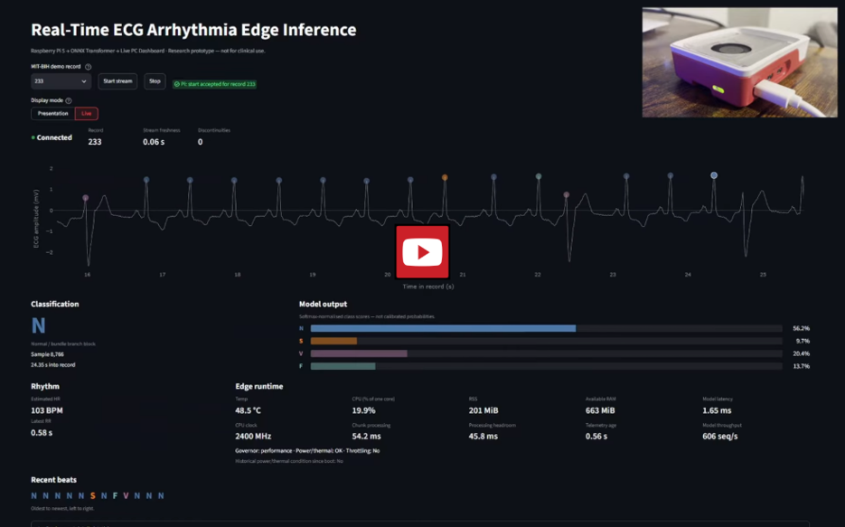
</a>

</div>

> [!IMPORTANT]
> **Research and educational prototype only.** This software is not a medical device and must not be used for diagnosis, treatment, triage, or clinical decision-making.

## Contents

- [At a glance](#at-a-glance)
- [What makes this project different](#what-makes-this-project-different)
- [System architecture](#system-architecture)
- [1. Modelling](#1-modelling)
- [2. From expert annotations to a real detector](#2-from-expert-annotations-to-a-real-detector)
- [3. Deployment fidelity](#3-deployment-fidelity)
- [4. Quantisation](#4-quantisation-smaller-no-worse--and-still-not-selected)
- [5. Real-time on the Raspberry Pi](#5-real-time-on-the-raspberry-pi)
- [6. Live system: transport, dashboard and remote control](#6-live-system-transport-dashboard-and-remote-control)
- [Final deployment decision](#final-deployment-decision)
- [Quick start](#quick-start)
- [Evidence index](#evidence-index)
- [Limitations and responsible interpretation](#limitations-and-responsible-interpretation)

## At a glance

| Question | Answer | Where it was measured |
|:--|:--|:--|
| How well does the model classify beats from unseen patients? | **94.96% accuracy and 0.5340 macro F1** vs **80.12% / 0.4112** for the CNN + RR baseline on identical beats | Expert-centred, target-matched, patient-disjoint test set |
| Does it still work when a real R-peak detector replaces expert annotations? | **94.65% accuracy, 0.5268 macro F1** on **15,263** XQRS-centred sequences from **7 unseen records** | Locked deployment-style test set |
| Which R-peak detector was selected, and how well did it perform? | **XQRS detector F1 = 0.9972** (precision 0.9997, recall 0.9947), with **1.97 ms mean absolute R-peak localisation error** | 6 validation records, 14,660 annotated beats |
| Does the streaming pipeline reproduce the offline one? | **14,587 / 14,588** peaks matched; every remaining difference traced and explained; **0 unexplained mismatches** | 3.9 M samples replayed as 36-sample chunks |
| Does ONNX preserve the PyTorch model? | **100% class agreement** on 14,556 sequences; max logit difference **9.418 × 10⁻⁶**; offline vs streaming ONNX **bit-for-bit identical** | Three-way parity test |
| How fast is it on the target hardware? | **1.332 ms** mean model-stage latency, **750.9 sequences/s** (FP32) | Raspberry Pi 5, ONNX Runtime CPU |
| Does INT8 quantisation help? | **2.84× smaller** (2.310 → 0.813 MiB), **99.35%** agreement with FP32 and **no observed validation-set quality loss** — but **2.89× slower** on the Pi, so FP32 was selected | Controlled, counterbalanced benchmarks on x86 and ARM |
| Does it meet real-time deadlines? | `ondemand` governor: **164 misses**. `performance` governor: **0 misses**, worst chunk 78.4 ms against a 100 ms budget | Paced replay of a full 30-minute record |
| Is it stable over time? | **210 minutes, 126,002 chunks, 16,381 predictions, 0 deadline misses, 0 integrity failures, no throttling** | Sustained Raspberry Pi endurance run |
| How is all of this verified? | **730 tests** (715 unit, 15 integration) across 68 modules, Ruff formatting and linting, GitHub Actions CI | This repository |

Every number above is backed by a committed, machine-readable result under [`artifacts/results/`](artifacts/results/); the [evidence index](#evidence-index) maps each claim to its file. The full 37-milestone engineering record is in [`notes/progress_log.md`](notes/progress_log.md).

## What makes this project different

Many ECG classification projects focus primarily on offline metrics. This project treats the offline model as the *starting* point and then asks, at every stage, whether the deployed system still behaves like the system that was evaluated:

- **Leakage-aware by design.** Train/validation/test splits are made by *patient*, never by beat. MIT-BIH records `201` and `202` come from the same person and are treated as one patient. The test records are excluded from training, validation, detector selection and fine-tuning, and are used only for final evaluation of fixed candidate checkpoints.
- **Causal by construction.** Each prediction uses the current beat and four previous beats. No future samples are ever visible, which is what makes the same model valid for real-time inference.
- **The detector gap is measured, not assumed.** The same validation targets were paired under expert-centred and XQRS-centred windows to quantify exactly how much a real R-peak detector costs the model (**99.03%** prediction agreement, −0.0168 macro F1).
- **Validation gains that did not generalise were rejected.** XQRS-centred fine-tuning improved validation macro F1 by +0.012 but lowered *test* macro F1 by −0.027 and weakened every minority class, so the original checkpoint was kept.
- **Parity is proven at every hand-off.** Offline → streaming preprocessing, PyTorch → ONNX, and offline ONNX → live streaming ONNX are each verified on identical inputs.
- **Hardware decisions are evidence-led.** INT8 was smaller and showed no observed validation-set quality loss — and still lost, because it was slower on the actual Raspberry Pi and left only 2.38 ms of worst-case deadline headroom versus 15.36 ms for FP32.
- **Real-time claims include the worst case.** Deadline misses, scheduling jitter, CPU governor behaviour, temperature, throttling flags and memory growth were all measured over hours, not seconds.
- **Production-shaped software.** Immutable events, strict tensor contracts, bounded dashboard state, TCP frame reconstruction, strict control-message validation, dependency isolation enforced by clean-subprocess tests, and structured JSON outputs for every experiment.

## System architecture


```mermaid
flowchart LR
    subgraph PI["Raspberry Pi 5 · edge runtime"]
        SRC["MIT-BIH replay / future live source<br/>360 Hz · 36-sample chunks"]
        BUF["Continuity checks + rolling buffer"]
        XQRS["Causal overlapping-window XQRS"]
        FEAT["240-sample beat windows<br/>previous RR + local RR ratio"]
        SEQ["5-beat causal sequence"]
        ORT["FP32 ONNX Runtime<br/>CPUExecutionProvider"]
        EVENT["PredictionEvent + Pi telemetry"]
        CTRL["Control server<br/>start_record · stop · status"]
        SRC --> BUF --> XQRS --> FEAT --> SEQ --> ORT --> EVENT
        CTRL -. orchestrates .-> SRC
    end
    subgraph PC["PC · dashboard runtime"]
        RX["TCP receiver<br/>port 8765"]
        STATE["Thread-safe bounded<br/>DashboardState"]
        LIVE["Atomic localhost /live API<br/>port 8766"]
        UI["Streamlit + Plotly dashboard"]
        CC["Control client"]
        RX --> STATE --> LIVE --> UI
        UI --> CC
    end
    EVENT -- "versioned NDJSON<br/>samples · predictions · runtime status" --> RX
    CC -- "TCP control · port 8767" --> CTRL
```

There is exactly one inference path. The CLI sender, the remotely controlled sender and every benchmark share the same `run_record_stream()` implementation, and the dashboard never runs a second model:

```text
SampleChunk → StreamingEngine → causal XQRS → beat window + RR features
            → five-beat sequence → ONNXSequenceClassifier → PredictionEvent
            → TCP transport → DashboardState → browser
```

## 1. Modelling

### Input representation

| Component | Representation |
|:--|:--|
| Signal | Single-lead ECG (MLII where available), 360 Hz |
| Beat morphology | 240 samples: 90 before and 150 after the R-peak |
| Rhythm features | Previous RR interval (s) and its ratio to the recent local rhythm |
| Temporal context | Five causal beats: `[i-4, i-3, i-2, i-1, i]` |
| Target | AAMI class of beat `i` — **N** (normal / bundle branch block), **S** (supraventricular ectopic), **V** (ventricular ectopic), **F** (fusion) |

The `Q` group is excluded for low support and ambiguity, and the four paced records (`102`, `104`, `107`, `217`) are excluded because paced beats fall outside the four-class target.

### Patient-level splitting and leakage prevention

Beats are extracted around expert annotations with WFDB, mapped to AAMI groups, and stored alongside their patient IDs so that splitting can be validated after the fact. A Monte Carlo search finds a patient-level split that approximately preserves both the target ratios and the class distribution, and a post-split check asserts that no patient appears in more than one partition. Sequence samples never cross record boundaries and retain their target indices so that any prediction can be traced back to a specific beat.

Two complementary views of the same seven patient-disjoint test records (`100`, `103`, `118`, `121`, `207`, `221`, `223`) are used:

- **Expert-centred, target-matched evaluation:** 15,352 sequences with windows centred on expert annotations, used for a fair CNN-versus-Transformer comparison.
- **XQRS-centred deployment evaluation:** 15,263 sequences produced with the selected detector, used to measure real-system performance.

The records were held out from training, validation, detector selection and fine-tuning. The class support below refers to the XQRS-centred deployment evaluation and shows why accuracy alone would be misleading:

| Class | N | S | V | F |
|:--|--:|--:|--:|--:|
| Test support (15,263 sequences) | 13,923 | 312 | 1,014 | 14 |

Macro F1, per-class F1, confusion matrices and class support are therefore reported everywhere alongside accuracy.

### From a CNN baseline to a CNN–Transformer

The model was built up one controlled change at a time, keeping the same patient split throughout so that each step is attributable:

| Step | Model | What changed | Test macro F1 | S F1 | V F1 |
|:--|:--|:--|--:|--:|--:|
| 1 | CNN V1 | Plain 1D CNN on isolated 240-sample beats | 0.2807 | 0.0287 | 0.2450 |
| 2 | CNN V2 | Wider channels, BatchNorm, dropout | 0.3256 | 0.0537 | 0.4118 |
| 3 | CNN V2 + RR | Adds previous-RR and RR-ratio timing features | 0.4113 | 0.2397 | 0.5097 |
| 4 | **CNN–Transformer** | Five-beat causal context + 3-layer Transformer encoder | **0.5340** | **0.2939** | **0.8382** |

Step 3 tested a specific hypothesis: supraventricular beats often look morphologically normal but arrive *early*, so a morphology-only CNN predicts them as `N`. Adding two RR features raised S precision from 0.035 to 0.310 and S F1 from 0.054 to 0.240 — the largest single-class gain in the CNN family — which motivated giving the model a full rhythm history.

**Architecture.** Each beat is independently encoded by a CNN into a 128-dimensional morphology embedding; a small MLP turns its two RR features into a 16-dimensional rhythm embedding. The two are concatenated, projected to `d_model = 128`, combined with learned positional embeddings and passed through a three-layer, four-head Transformer encoder (feed-forward width 256). The output token for the final beat is classified into the four AAMI groups.

**Tuning.** Ten configurations were compared on validation macro F1 only; the test set was untouched until the configuration was fixed.

<p align="center">
  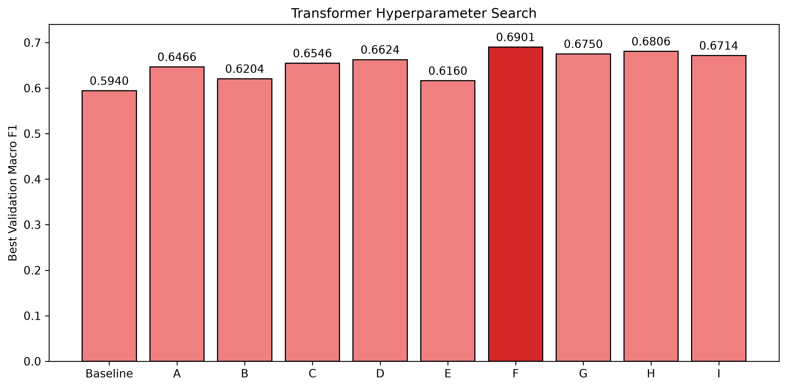
</p>

The selected configuration (Experiment F) used a learning rate of `3e-4`, dropout `0.2`, three Transformer layers, inverse-frequency class weights, early stopping with a patience of 10 and seed `42`.

**Target-matched result.** The Transformer and the strongest CNN were evaluated on exactly the same test beats:

| Model | Accuracy | Macro F1 | N F1 | S F1 | V F1 | F F1 |
|:--|--:|--:|--:|--:|--:|--:|
| CNN V2 + RR | 0.8012 | 0.4112 | 0.8935 | 0.2397 | 0.5091 | 0.0023 |
| **CNN–Transformer** | **0.9496** | **0.5340** | **0.9766** | **0.2939** | **0.8382** | **0.0274** |

<p align="center">
  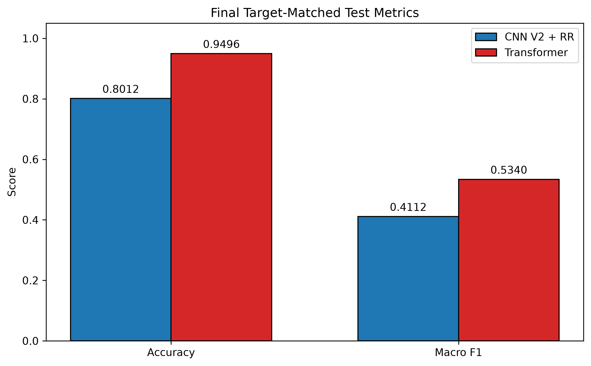
  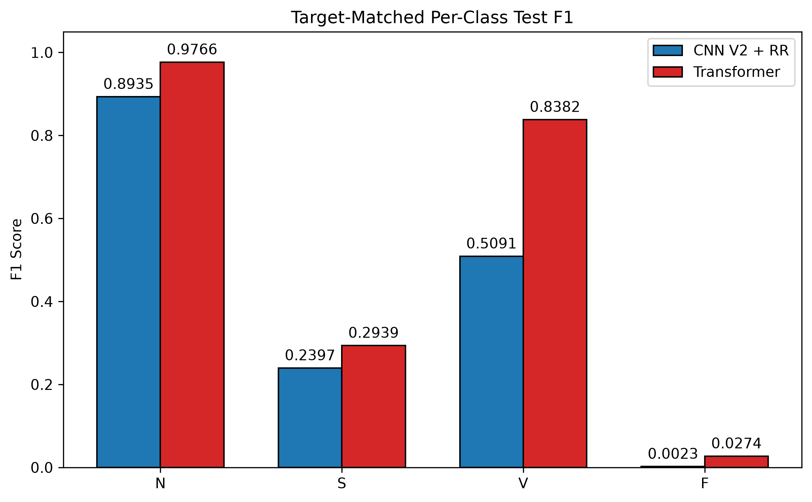
</p>

<p align="center">
  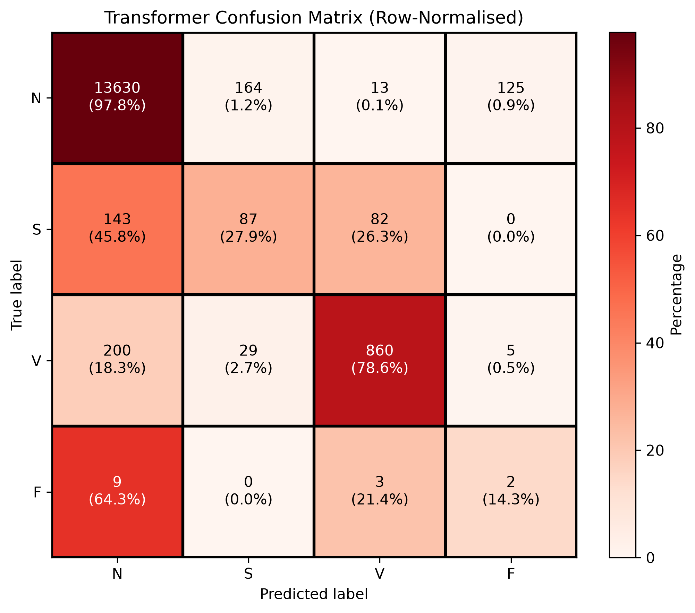
</p>

The confusion matrix is shown deliberately: 78.6% of ventricular beats and 97.8% of normal beats are recovered, but 45.8% of supraventricular beats are still predicted as normal, and the fusion class — 14 test examples — is effectively unresolved. Those are the honest limits of the model.

## 2. From expert annotations to a real detector

A deployed system does not have expert R-peak annotations. Three interchangeable detectors were evaluated with strict one-to-one chronological matching against the expert annotations on the validation records:

| Detector | F1 | Precision | Recall | False positives | False negatives | Mean absolute offset |
|:--|--:|--:|--:|--:|--:|--:|
| **XQRS** | **0.9972** | **0.9997** | **0.9947** | **5** | **77** | **1.97 ms** |
| Hamilton | 0.9961 | 0.9991 | 0.9930 | 13 | 102 | 53.47 ms |
| Elgendi | 0.9791 | 0.9655 | 0.9931 | 521 | 101 | 71.21 ms |

Detection F1 alone would have made Hamilton look nearly equivalent. The 27× difference in localisation error is what mattered: a shifted R-peak shifts the 240-sample morphology window *and* changes the RR features fed to the Transformer.

### Measuring the deployment gap

Rather than assuming the model would tolerate detector noise, the same 14,548 validation targets were built twice — once centred on expert annotations, once on XQRS detections, with the XQRS build allowing *all* detections (including unmatched ones) to shape the RR history and sequence context — and evaluated with the same checkpoint:

| Metric | Expert-centred | XQRS-centred | Change |
|:--|--:|--:|--:|
| Accuracy | 0.9687 | 0.9634 | −0.0053 |
| Macro F1 | 0.6920 | 0.6752 | −0.0168 |
| Prediction agreement | | **99.03%** | |

### Rejecting a fine-tuning result that did not generalise

Fine-tuning the model on XQRS-centred training data (`lr = 7e-6`, capped inverse class weights) improved *every* validation metric. It was then evaluated on the locked test records:

| Metric | Original | XQRS fine-tuned | Change |
|:--|--:|--:|--:|
| Validation macro F1 | 0.6752 | **0.6872** | +0.0120 |
| Test accuracy | 0.9465 | **0.9518** | +0.0052 |
| Test macro F1 | **0.5268** | 0.5001 | −0.0267 |
| Test S F1 | **0.2782** | 0.2547 | −0.0235 |
| Test V F1 | **0.8235** | 0.7658 | −0.0577 |
| Test F F1 | **0.0308** | 0.0000 | −0.0308 |

<p align="center">
  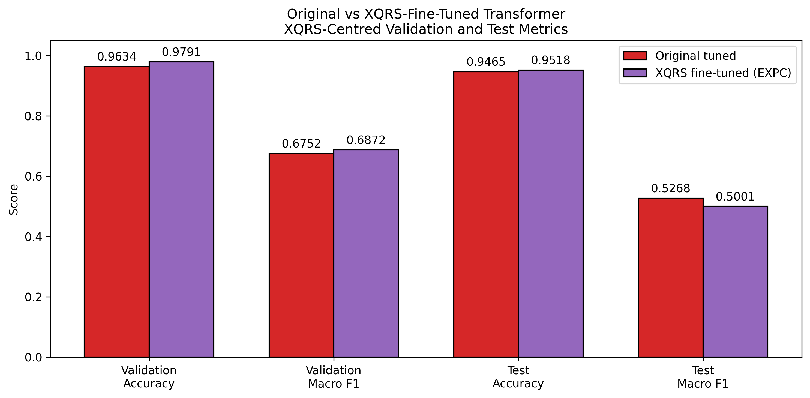
  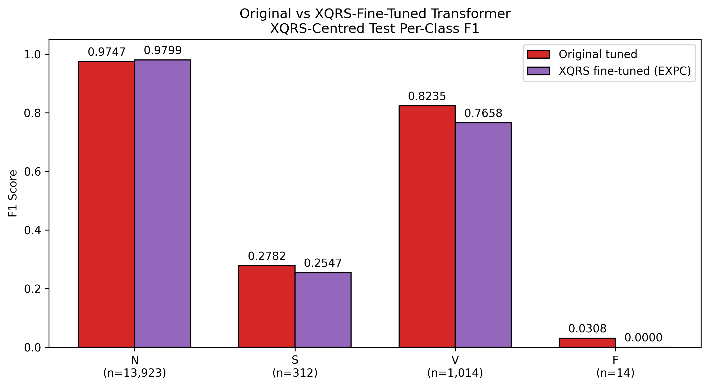
</p>

The fine-tuned model corrected 216 test predictions and broke 136, but its gains were concentrated in the dominant `N` class while every minority class got worse. Test accuracy went *up* and test macro F1 went *down*. The original checkpoint was retained as the deployment model — the decision was made on generalisation to unseen patients, not on the more flattering validation number.

## 3. Deployment fidelity

### Streaming preprocessing reproduces the offline pipeline

The real-time engine consumes 36-sample chunks, maintains an absolute-indexed rolling buffer, runs a causal overlapping-window XQRS with warm-up and confirmation, delays beat construction until post-peak samples exist, and assembles five-beat sequences. All six validation records were replayed and compared against the offline XQRS-centred dataset:

| Check | Result |
|:--|--:|
| Samples accepted, in order | 3,900,000 / 3,900,000 |
| Whole-record XQRS peaks reproduced exactly | 14,587 / 14,588 |
| Offline target sequences reproduced exactly | 14,496 / 14,548 |
| Maximum offset on shared peaks | 0 samples |
| ECG-window / RR-feature mismatches | 18 / 51 — **every one traced to a documented causal-vs-whole-record detector divergence** |
| Unexplained mismatches | **0** |

The streaming engine also rejects missing, duplicate, overlapping or out-of-order chunks and sampling-rate changes within a record, and behaviour was confirmed to be identical across several chunk sizes.

### PyTorch → ONNX → live streaming: three-way parity

The tuned model was exported to ONNX (fixed five-beat sequence, dynamic batch) with a validated input/output contract (`ecg_sequence`, `rr_sequence`, `logits`). The same 14,556 streaming-emitted sequences were then classified three ways:

| Comparison | Class agreement | Mean \|Δlogit\| | Max \|Δlogit\| | Outside `rtol=atol=1e-5` |
|:--|--:|--:|--:|--:|
| PyTorch vs offline ONNX | 100% | 5.665 × 10⁻⁷ | 9.418 × 10⁻⁶ | 0 |
| Offline ONNX vs streaming ONNX | 100% | **0.0** | **0.0** | 0 |
| PyTorch vs streaming ONNX | 100% | 5.665 × 10⁻⁷ | 9.418 × 10⁻⁶ | 0 |

<p align="center">
  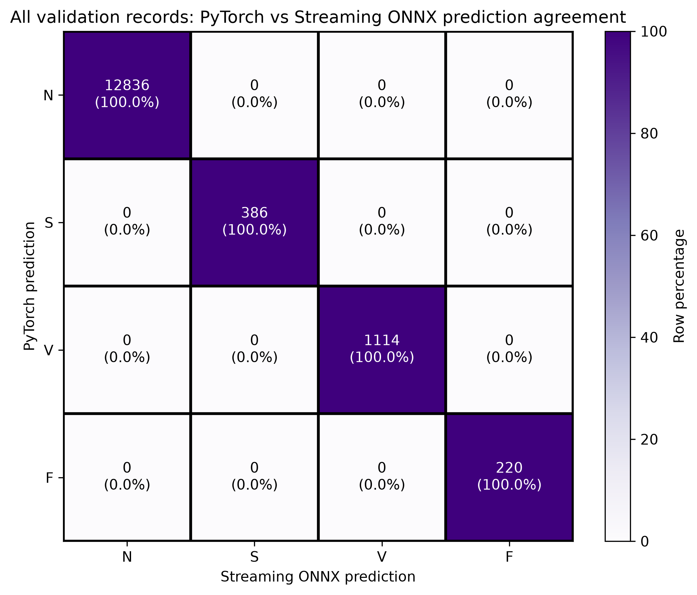
  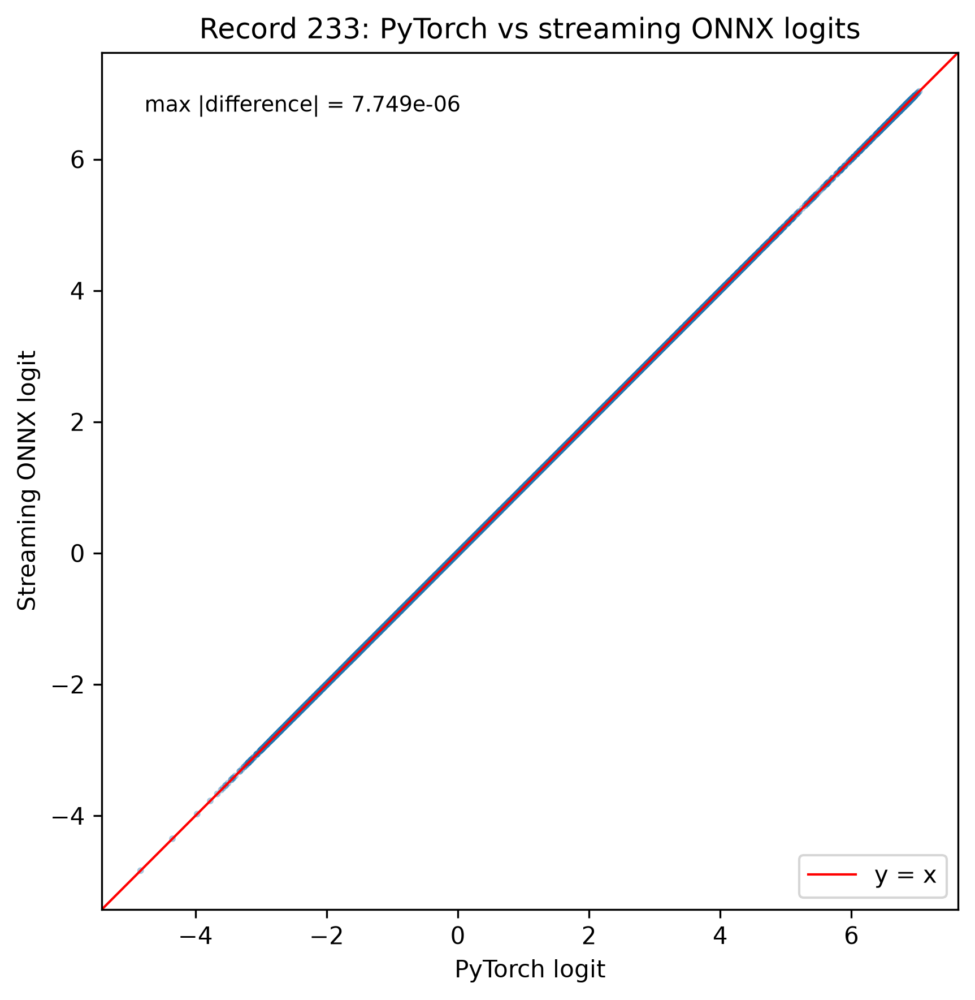
</p>

The live streaming wrapper is bit-for-bit identical to offline ONNX Runtime, and the residual PyTorch/ONNX float differences never changed a single predicted class.

## 4. Quantisation: smaller, no worse — and still not selected

Dynamic INT8 quantisation was evaluated as a full deployment candidate rather than as a footnote. Each question was answered separately, on identical streaming-emitted inputs.

**Does it change the model?**

| Metric | FP32 | INT8 |
|:--|--:|--:|
| Model size | 2.310 MiB | **0.813 MiB** (−64.79%, 2.84×) |
| Class agreement on 14,556 sequences | | **99.3473%** (95 disagreements) |
| Mean / max absolute logit drift | | 0.0721 / 1.2124 |
| Validation accuracy | 0.96357 | **0.96563** |
| Validation macro F1 | 0.67577 | **0.69014** |
| Validation S F1 | 0.79353 | **0.83895** |

<p align="center">
  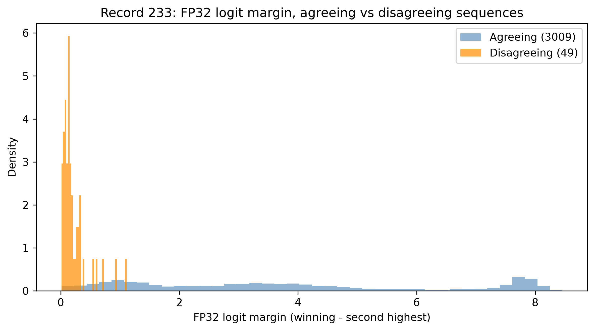
  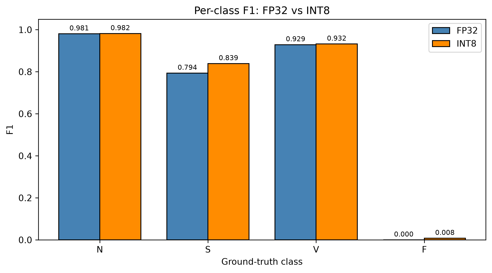
</p>

The 95 class changes were not random: they sit almost entirely on sequences where the FP32 model's winning logit barely exceeded the runner-up (left). Against ground truth, INT8 matched or slightly exceeded FP32 on every class (right). Quantisation therefore cost nothing in predictive quality on this validation data.

**Is it faster?** No — on either platform.

| Platform | FP32 mean latency | INT8 mean latency | FP32 throughput | INT8 throughput |
|:--|--:|--:|--:|--:|
| Development x86 CPU | **0.681 ms** | 3.658 ms | **1,473 seq/s** | 273 seq/s |
| **Raspberry Pi 5** | **1.332 ms** | 3.850 ms | **750.9 seq/s** | 259.7 seq/s |

<p align="center">
  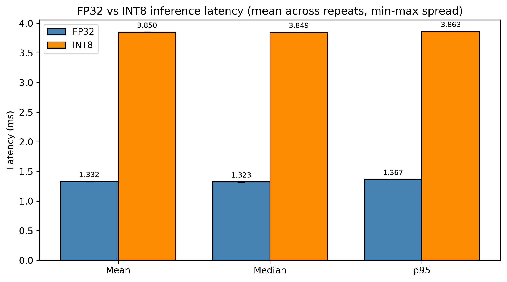
  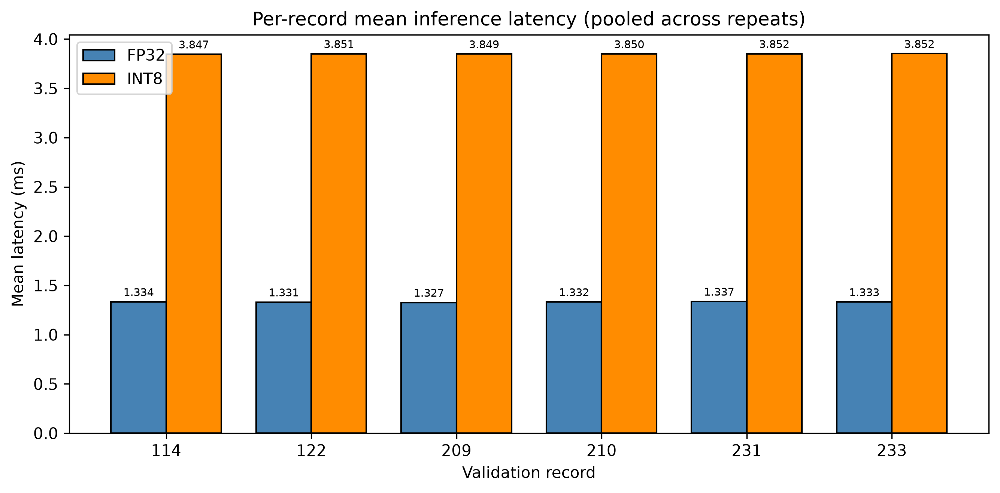
</p>

Both benchmarks used 100 warm-up calls, five full timed passes and counterbalanced FP32/INT8 execution order to cancel thermal and load drift; the ordering held on every record. INT8 initialised faster (38.8 ms vs 76.9 ms), but FP32 recovers that one-off cost after roughly 15 inferences. The intuition that a smaller model is a faster model did not survive contact with this hardware and runtime, which is exactly why size, quality and speed were measured independently.

## 5. Real-time on the Raspberry Pi

### Runtime validation

Both precisions were first run through the full production streaming path on the Pi (record `114`, 650,000 samples, 18,056 chunks). Both emitted 1,873 prediction events on identical target peaks with zero integrity failures, and the Pi reported no throttling.

### The CPU governor is part of the configuration

Each 36-sample chunk represents 100 ms of ECG, so 100 ms is the hard budget for processing it. Replaying a full record paced at its true 360 Hz arrival rate exposed a problem that average latency completely hides:

| Metric | FP32 `ondemand` | FP32 `performance` | INT8 `ondemand` | INT8 `performance` |
|:--|--:|--:|--:|--:|
| Mean chunk latency | 1.7506 ms | **1.3732 ms** | 2.0410 ms | **1.6349 ms** |
| Maximum chunk latency | 112.61 ms | **78.44 ms** | 135.56 ms | **92.94 ms** |
| Maximum scheduling lateness | 12.77 ms | **0.072 ms** | 35.73 ms | **0.074 ms** |
| Deadline misses (of 18,056) | 164 | **0** | 178 | **0** |
| Worst deadline margin | −12.67 ms | **+21.51 ms** | −35.61 ms | **+7.01 ms** |

<p align="center">
  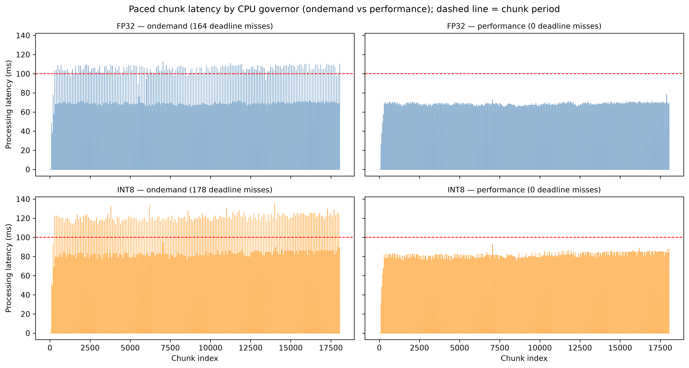
</p>

<p align="center">
  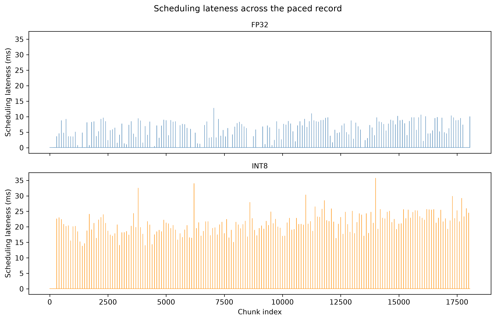
  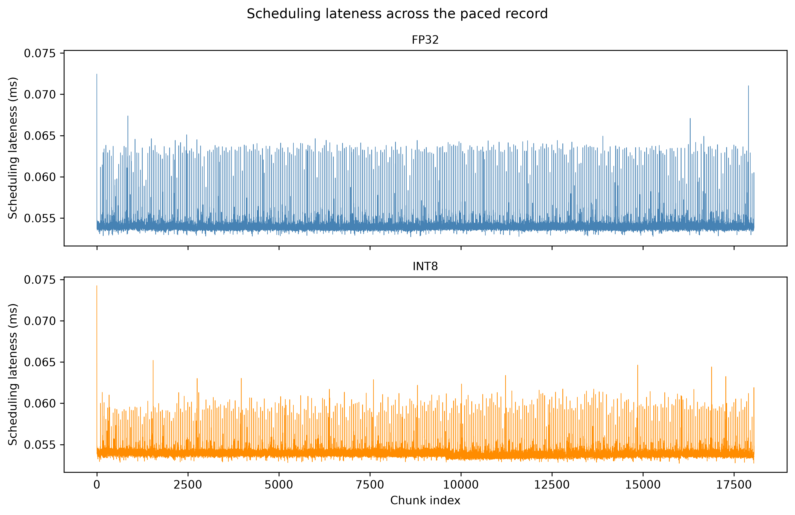
</p>

Under `ondemand`, mean latency was under 2 ms and yet roughly 1% of chunks missed their deadline. Switching to the `performance` governor eliminated every miss and reduced scheduling jitter by more than two orders of magnitude (note the y-axis scale: 35 ms on the left, 0.075 ms on the right). The governor is therefore recorded as part of the selected deployment configuration, not as an optional tweak.

### Sustained operation

Matched one-hour real-time runs cycled through all six validation records with periodic hardware telemetry:

| Metric | FP32 — 60 min | INT8 — 60 min |
|:--|--:|--:|
| Chunks / predictions | 36,000 / 4,329 | 36,000 / 4,329 |
| Deadline misses / integrity failures | **0 / 0** | **0 / 0** |
| Maximum processing latency | **84.59 ms** | 97.57 ms |
| Minimum deadline margin | **15.36 ms** | 2.38 ms |
| Mean process CPU (one core) | **3.46%** | 4.67% |
| Mean / max temperature | 47.4 °C / 49.6 °C | 47.4 °C / 49.6 °C |
| Throttling | None | None |

<p align="center">
  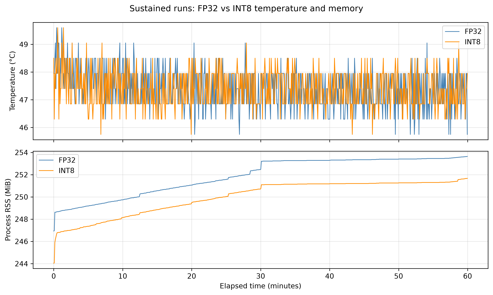
</p>

Both precisions passed, but INT8 came within 2.38 ms of a missed deadline while FP32 kept more than six times that margin. The selected FP32 configuration was then run for **210 minutes**:

<p align="center">
  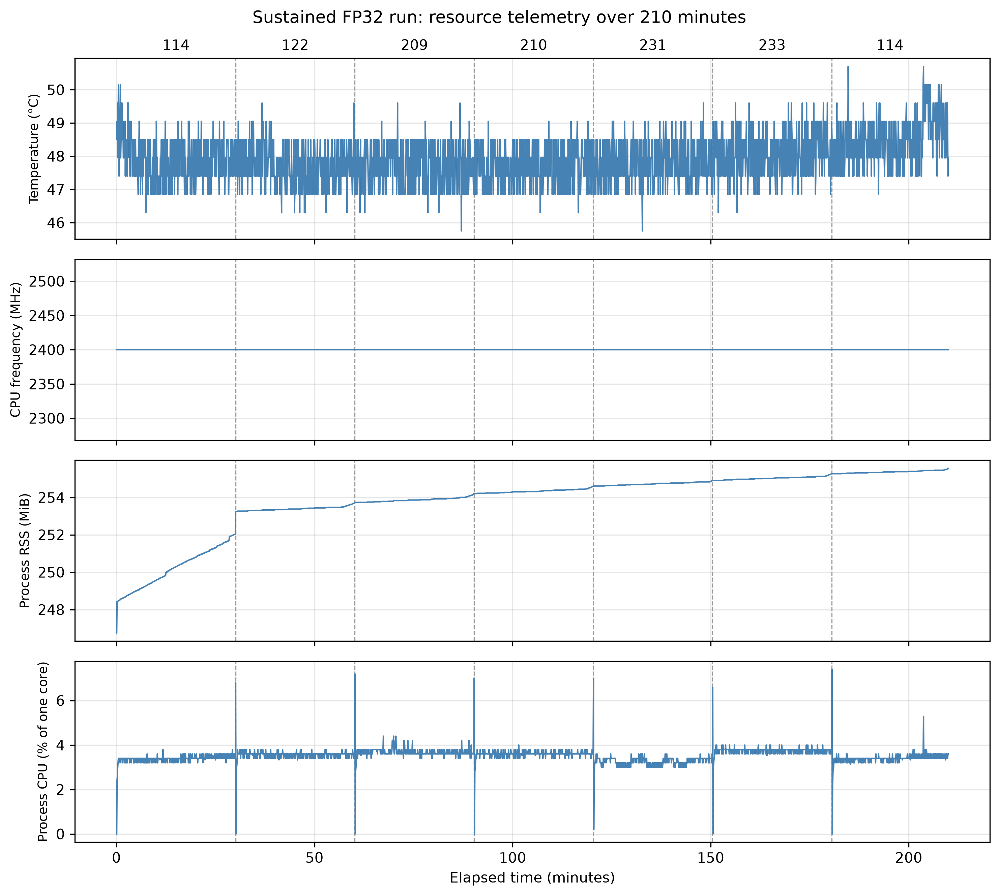
</p>

| Metric | FP32 — 210 min |
|:--|--:|
| Chunks / predictions | 126,002 / 16,381 |
| Deadline misses / integrity failures | **0 / 0** |
| Minimum deadline margin | 19.98 ms |
| Mean process CPU | 3.52% |
| Maximum temperature | 50.7 °C, no throttling, constant 2.4 GHz |
| Process RSS | +8.80 MiB, fitted trend falling to +1.41 MiB/hour |

The one-hour RSS slope (+5.42 MiB/hour) would have looked like a leak if extrapolated; the 3.5-hour run shows the growth progressively flattening. Memory is reported descriptively and was deliberately *not* used to score FP32 against INT8.

## 6. Live system: transport, dashboard and remote control

The validated Pi pipeline is wrapped as a networked edge system with two deliberately separated channels:

| Channel | Direction | Port | Payload |
|:--|:--|--:|:--|
| Data | Pi → PC | 8765 | Versioned NDJSON `sample_chunk`, `prediction`, `runtime_status` messages with TCP frame reconstruction |
| Live view | PC-local | 8766 | Atomic `/live` snapshots for the browser, loopback-only |
| Control | PC → Pi | 8767 | `start_record`, `stop`, `status` with strict schema validation and a record allowlist |

**Dashboard.** A background thread applies incoming messages to a thread-safe, bounded `DashboardState`; the browser polls an atomic snapshot every ~100 ms so the waveform, prediction markers, class scores, RR/heart-rate estimate and Pi telemetry shown together always come from the same moment. Waveform updates are incremental during a contiguous stream and rebuilt only when continuity cannot be preserved (record change, sampling-rate change, index regression, unbridgeable gap). `Presentation` and `Live` modes change only how long each prediction is displayed, never the inference path.

**Remote control.** The Pi control agent runs at most one stream worker at a time, stops and joins the previous worker before starting a replacement so two data senders never overlap, and honours a cooperative stop flag checked once per chunk. Dashboard commands can select only an allowlisted action and record; the Pi retains ownership of the model path, chunk size, replay mode and data destination, so a command cannot redirect the stream or swap the model. Clean-subprocess tests enforce that importing dashboard-side modules never pulls in the Pi-side WFDB stack.

The complete path — dashboard start command, Pi acceptance, returning ECG stream, live predictions and telemetry, stop and restart — was validated end-to-end over a home LAN with zero observed stream discontinuities, running on the `performance` governor at 2.4 GHz.

## Final deployment decision

| Setting | Selected value |
|:--|:--|
| Precision | **FP32** |
| Model | [`artifacts/models/ecg_sequence_transformer.onnx`](artifacts/models/ecg_sequence_transformer.onnx) |
| Runtime | ONNX Runtime `CPUExecutionProvider` |
| Target | Raspberry Pi 5, `performance` CPU governor |
| R-peak detector | XQRS (causal, overlapping-window) |
| Signal cadence | 360 Hz, 36 samples/chunk, 100 ms/chunk |
| Model input | Five causal beats × (240 ECG samples + 2 RR features) |

The decision was made criterion by criterion rather than with a weighted score. INT8 won on model size and initialisation time and tied on runtime correctness, thermal behaviour and zero-miss stability. FP32 won on mean, median and p95 latency, throughput, sustained CPU use and worst-case deadline headroom on the target hardware. INT8 is retained as the storage-optimised alternative for deployments where model size is the overriding constraint.

## Quick start

### Installation

Requirements: Python 3.12+, network access on first run (WFDB fetches MIT-BIH records from PhysioNet), and a Raspberry Pi 5 to reproduce the target-hardware measurements.

```bash
git clone https://github.com/Daniel-Lawless/ECG-Arrhythmia-Edge-Transformer.git
cd ECG-Arrhythmia-Edge-Transformer
python3.12 -m venv .venv
source .venv/bin/activate          # Windows PowerShell: .venv\Scripts\Activate.ps1
python -m pip install --upgrade pip
pip install -e ".[dev,dashboard]"
```

On CPU-only machines, install PyTorch from the CPU index first (as CI does): `pip install torch --index-url https://download.pytorch.org/whl/cpu`.

### Running the live edge demo

**1. Start the dashboard on the PC**, pointing it at the Pi's hostname or LAN IP:

```bash
export ECG_PI_CONTROL_HOST=ecg-pi.local     # PowerShell: $env:ECG_PI_CONTROL_HOST = "ecg-pi.local"
python -m streamlit run src/ecg_arrhythmia/dashboard/app.py
```

| Variable | Purpose | Default |
|:--|:--|--:|
| `ECG_DASHBOARD_HOST` / `ECG_DASHBOARD_PORT` | Pi → PC data listener | `0.0.0.0` / `8765` |
| `ECG_LIVE_HTTP_HOST` / `ECG_LIVE_HTTP_PORT` | Browser live endpoint | `127.0.0.1` / `8766` |
| `ECG_PI_CONTROL_HOST` / `ECG_PI_CONTROL_PORT` | Pi control agent | project default / `8767` |

**2. Start the control agent on the Raspberry Pi**, replacing `<PC_IP>` with the address the Pi can reach:

```bash
python -m ecg_arrhythmia.transport.control_server --host <PC_IP> --port 8765
```

Then select a record in the dashboard and press **Start stream**. For one-way streaming without remote control:

```bash
python -m ecg_arrhythmia.transport.send_record --host <PC_IP> --record 233 --mode real_time
```

> [!WARNING]
> The control channel is unauthenticated plaintext TCP with no TLS. Use it only on a trusted local or direct network and never expose port 8767 to the internet.

### Reproducing the ML pipeline

```bash
# 1. Beat-level dataset from MIT-BIH via WFDB
python -m ecg_arrhythmia.data.build_dataset

# 2. Patient-level CNN splits
python -m ecg_arrhythmia.data.split_dataset

# 3. Five-beat causal sequences
python -m ecg_arrhythmia.data.sequence_dataset \
  --input-dir data/processed --output-dir data/processed_sequences --sequence-length 5

# 4. Reuse the CNN patient assignments so the model comparison is fair
python -m ecg_arrhythmia.data.match_sequence_splits \
  --input-dir data/processed_sequences --reference-split-dir data/splits \
  --output-dir data/splits_sequences_matched

# 5. Train the selected configuration
python -m ecg_arrhythmia.training.transformer_training \
  --train-set-dir data/splits_sequences_matched/train \
  --val-set-dir data/splits_sequences_matched/val \
  --learning-rate 3e-4 --dropout 0.2 --num-layers 3 --class-weighting inverse --seed 42 \
  --model-output-path artifacts/models/ecg_sequence_transformer_tuned.pt

# 6. Export with a fixed five-beat sequence and dynamic batch size
python -m ecg_arrhythmia.deployment.export_transformer_to_onnx \
  --checkpoint-path artifacts/models/ecg_sequence_transformer_tuned.pt \
  --output-path artifacts/models/ecg_sequence_transformer.onnx \
  --num-layers 3 --sequence-length 5

# 7. Verify PyTorch ↔ ONNX parity, then optionally build the INT8 candidate
python -m ecg_arrhythmia.deployment.verify_onnx_parity
python -m ecg_arrhythmia.deployment.quantize_onnx
```

The detector, streaming-parity, quantisation, benchmark and Raspberry Pi evaluation scripts live under `src/ecg_arrhythmia/evaluation/`; each writes a structured JSON result under `artifacts/results/`.

## Testing and CI

```bash
ruff format --check .
ruff check .
pytest tests/unit/           # 715 tests across 56 modules
pytest tests/integration/    # 15 tests across 12 modules, real MIT-BIH records
```

GitHub Actions runs formatting, linting and the unit suite on every push and pull request; the real-data integration suite runs on manual dispatch. Coverage spans preprocessing, split safety, models, R-peak detection and matching, ONNX contracts, three-way parity, quantisation, benchmark statistics, Pi telemetry parsing, real-time scheduling logic, TCP framing, dashboard state, control-channel lifecycle and clean-process dependency isolation.

## Repository layout

```text
.
├── .github/workflows/ci.yml
├── artifacts/
│   ├── figures/                 # model, detector, parity, quantisation and Pi plots
│   ├── models/                  # selected FP32 ONNX deployment graph
│   └── results/                 # structured JSON evidence and selected raw arrays
├── assets/                      # dataset exploration figures
├── data/                        # committed lightweight split metadata
├── notes/progress_log.md        # 37-milestone engineering record
├── src/ecg_arrhythmia/
│   ├── dashboard/               # Streamlit shell, live endpoint, state, presentation, control strip
│   ├── data/                    # WFDB loading, AAMI labels, datasets, patient-level splitting
│   ├── deployment/              # ONNX export, parity verification, INT8 quantisation
│   ├── detection/               # XQRS, Hamilton and Elgendi detector interfaces
│   ├── evaluation/              # detector, parity, quantisation, benchmark and endurance tools
│   ├── models/                  # CNN baselines, beat/RR encoders, sequence Transformer
│   ├── preprocessing/           # beat windows and shared RR-feature calculation
│   ├── streaming/               # chunks, buffers, causal detection, assembly, ONNX inference
│   ├── telemetry/               # Raspberry Pi health sensors and live measurements
│   ├── training/                # weighted CNN and Transformer training
│   ├── transport/               # versioned NDJSON, TCP data channel, control channel
│   └── visualisation/           # reusable evaluation plots
└── tests/
    ├── unit/
    └── integration/
```

## Evidence index

| Claim | Evidence |
|:--|:--|
| Transformer vs CNN on matched test beats | [`ecg_sequence_transformer_tuned_matched_test_metrics.json`](artifacts/results/model_evaluation/ecg_sequence_transformer_tuned_matched_test_metrics.json), [`cnn_baseline_v2_rr_sequence_targets_test_metrics.json`](artifacts/results/model_evaluation/cnn_baseline_v2_rr_sequence_targets_test_metrics.json) |
| CNN ablation ladder (V1 → V2 → normalisation → RR) | [`artifacts/results/model_evaluation/`](artifacts/results/model_evaluation/) |
| Detector selection | [`detector_comparison.json`](artifacts/results/detection_evaluation/detector_comparison.json) |
| Expert vs XQRS deployment gap | [`transformer_paired_centering_comparison.json`](artifacts/results/model_evaluation/transformer_paired_centering_comparison.json) |
| Fine-tuning rejected on test evidence | [`transformer_xqrs_test_comparison.json`](artifacts/results/model_evaluation/transformer_xqrs_test_comparison.json), [`transformer_xqrs_EXPC_summary.json`](artifacts/results/model_evaluation/transformer_xqrs_EXPC_summary.json) |
| Streaming reproduces offline preprocessing | [`streaming_parity_summary.json`](artifacts/results/streaming_evaluation/streaming_parity_summary.json) |
| PyTorch ↔ ONNX parity | [`pytorch_onnx_parity_summary.json`](artifacts/results/deployment_evaluation/pytorch_onnx_parity/pytorch_onnx_parity_summary.json) |
| Three-way streaming inference parity | [`streaming_inference_parity_summary.json`](artifacts/results/deployment_evaluation/streaming_inference_parity/streaming_inference_parity_summary.json) |
| INT8 size, agreement and ground-truth quality | [`dynamic_int8_quantization_report.json`](artifacts/results/deployment_evaluation/quantization/dynamic_int8_quantization_report.json), [`quantization_agreement_summary.json`](artifacts/results/deployment_evaluation/quantization_agreement/quantization_agreement_summary.json), [`quantized_model_performance_summary.json`](artifacts/results/deployment_evaluation/quantized_model_performance/quantized_model_performance_summary.json) |
| FP32 vs INT8 speed, x86 | [`fp32_vs_int8_benchmark.json`](artifacts/results/deployment_evaluation/onnx_benchmarking/fp32_vs_int8_benchmark.json) |
| FP32 vs INT8 speed, Raspberry Pi 5 | [`raspberry_pi_fp32_vs_int8_benchmark.json`](artifacts/results/deployment_evaluation/edge_onnx_benchmarking/raspberry_pi_fp32_vs_int8_benchmark.json) |
| Pi runtime validation | [`record_114_edge_runtime_validation.json`](artifacts/results/deployment_evaluation/edge_runtime_validation/record_114_edge_runtime_validation.json) |
| CPU governor and deadline behaviour | [`edge_realtime_streaming/`](artifacts/results/deployment_evaluation/edge_realtime_streaming/), [`edge_realtime_streaming_perf_governor/`](artifacts/results/deployment_evaluation/edge_realtime_streaming_perf_governor/) |
| Sustained 60-minute and 210-minute runs | [`edge_sustained_resources/`](artifacts/results/deployment_evaluation/edge_sustained_resources/) |

## Limitations and responsible interpretation

- These are research measurements on MIT-BIH, not evidence of clinical safety or efficacy.
- The model uses a single ECG lead; behaviour on other leads, devices, populations and acquisition conditions has not been established.
- The XQRS-centred deployment test contains only 14 fusion examples, and the class remains unreliable (F1 0.0308). Supraventricular recall is also limited: 45.8% of `S` beats are still predicted as `N`.
- Accuracy is inflated by the dominant `N` class; macro F1, class support and per-class metrics are the informative view.
- XQRS-centred labelled evaluation is necessarily expert-influenced: unmatched detections shape rhythm context, but only detections matched to expert annotations are scored.
- The small INT8 validation gain is based on one split and was not tested for statistical significance.
- Runtime results are specific to the tested Raspberry Pi 5, ONNX Runtime CPU provider and governor. Quantisation may behave differently on hardware with optimised INT8 kernels.
- The live source is a real-time replay of MIT-BIH records. A physical sensor/ADC needs a source adapter plus fresh signal-quality and safety validation.
- The control and data channels have no authentication or encryption and are intended for a trusted LAN only.

## Next engineering steps

- Validate on an external dataset and additional acquisition domains.
- Improve or reformulate the severely under-supported fusion class and raise supraventricular recall.
- Add probability calibration and low-confidence handling.
- Replace database replay with a live sensor adapter while keeping the existing `SampleChunk` contract.
- Authenticate and encrypt the control and data channels before any use outside a trusted network.

## Acknowledgements

This project uses the [MIT-BIH Arrhythmia Database](https://physionet.org/content/mitdb/1.0.0/) distributed by PhysioNet. Please cite the original database and PhysioNet when reusing the data or publishing derived work.

---

Built by [Daniel Lawless](https://github.com/Daniel-Lawless) as an end-to-end study in biomedical signal processing, imbalanced learning, causal sequence modelling, model export and quantisation, edge benchmarking, real-time systems and live visualisation.
